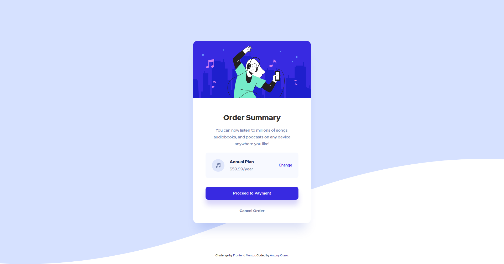

# Frontend Mentor - Order summary card solution

This is a solution to the [Order summary card challenge on Frontend Mentor](https://www.frontendmentor.io/challenges/order-summary-component-QlPmajDUj). Frontend Mentor challenges help you improve your coding skills by building realistic projects. 

## Table of contents

- [Overview](#overview)
  - [The challenge](#the-challenge)
  - [Screenshot](#screenshot)
  - [Links](#links)
- [My process](#my-process)
  - [Built with](#built-with)
  - [What I learned](#what-i-learned)
  - [Useful resources](#useful-resources)
- [Author](#author)

## Overview

### The challenge

Users should be able to:

- See hover states for interactive elements

### Screenshot



### Links

- Solution URL: [See my solution at frontendmentor.io](https://www.frontendmentor.io/solutions/order-summary-component-with-media-queries-N6dz1IIJl/)
- Live Site URL: [https://antonyotero.github.io/order-summary-component-main](https://antonyotero.github.io/order-summary-component-main)

## My process

### Built with

- Semantic HTML5 markup
- Flexbox
- CSS Grid
- Media Queries

### What I learned

To get the hero image to be responsive I had to contain the `` element within a `<div>` element and set its `max-width` to `100%`.

```html
<main>
  <div class="hero">
    
  </div>
  <div class="summary">
    <!-- ... -->
  </div>
</main>
```

```css
.hero img {
  max-width: 100%;
}

.hero,
.hero img {
  border-radius: 20px 20px 0 0;
}
```
### Useful resources

- [Google Fonts](https://fonts.google.com) - Making the web more beautiful, fast, and open through great typography and iconography
- [MDN Web Docs](https://developer.mozilla.org/en-US/) - Resources for developers, by developers.

## Author

- Website - [Antony Otero](https://github.com/AntonyOtero)
- Frontend Mentor - [@AntonyOtero](https://www.frontendmentor.io/profile/AntonyOtero)
- Twitter - [@AntonyOtero](https://www.twitter.com/AntonyOtero)
